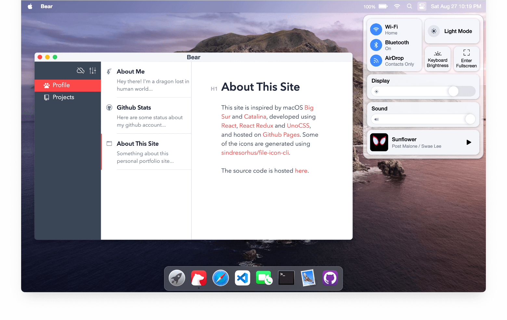
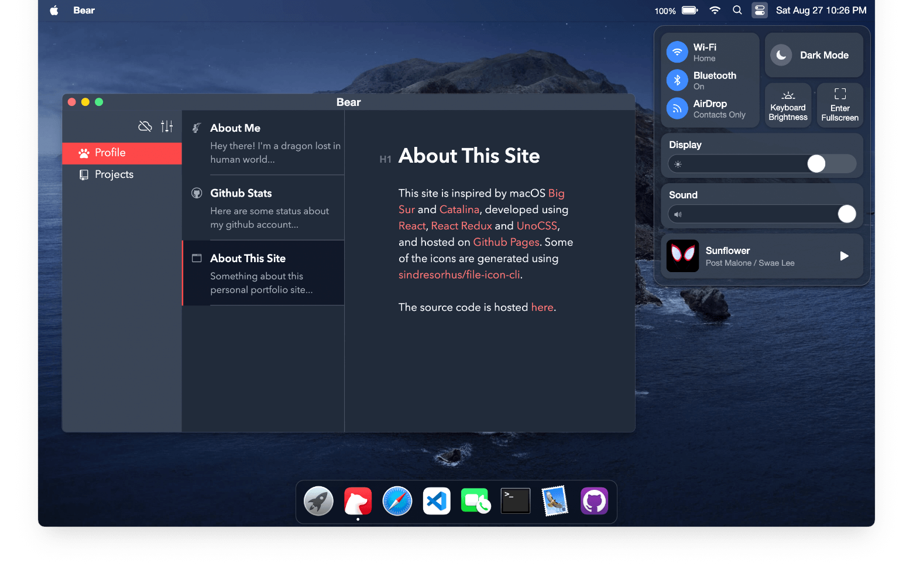

# 🍏 macos.dawidolko.pl  
_A TypeScript + React playground that recreates the macOS desktop right inside your browser_

[](https://github.com/dawidolko/Macos-Simulaing-System-GUI/actions)
[](https://macos.dawidolko.pl)
[](https://github.com/dawidolko/Macos-Simulaing-System-GUI/stargazers)

> **Live Demo:** <https://macos.dawidolko.pl>  

---

## 📑 Table of Contents
1. [About](#about)
2. [Project Structure](#project-structure)
3. [Star History](#star-history)
4. [Getting Started](#getting-started)
5. [Screenshots](#screenshots)
6. [Changelog](#changelog)
7. [Credits](#credits)
8. [Contributing](#contributing)
9. [License & Author](#license--author)

---

## About
`macos.dawidolko.pl` is an **open-source portfolio / desktop simulator** that mirrors the look-and-feel of modern macOS (Big Sur → Sonoma).  
Built with **React**, **TypeScript**, **Vite**, **UnoCSS** and **Zustand** for state-management, it delivers buttery-smooth animations, draggable windows, launchpad apps, a dynamic dock, and light/dark appearance that respects the system preference. 🍎🖥️

---

## Project Structure
```text
.
├── .github/          # GitHub Actions & issue templates
├── .husky/           # Pre-commit hooks
├── assets/           # Icons, wallpapers, fonts
├── img/              # Marketing images
├── logo/             # SVG/PNG logo variants
├── markdown/         # Blog posts / docs (rendered in-app)
├── music/            # Demo audio files
├── public/           # Static assets served at /
├── screenshots/      # Light / dark previews
├── src/              # Application code
│   ├── components/   # Re-usable React components
│   ├── containers/   # Window / desktop shells
│   ├── stores/       # Zustand stores
│   ├── theme/        # UnoCSS & design tokens
│   ├── utils/        # Helpers
│   ├── main.tsx      # Entry point
│   └── vite-env.d.ts # Type helpers
├── .editorconfig
├── .eslintrc
├── .gitattributes
├── .gitignore
├── .nojekyll
├── CNAME
├── LICENSE
├── README.md         # You are here!
├── index.html        # Vite HTML shell
└── manifest.json     # PWA manifest
````

---

## Star History

[](https://star-history.com/#dawidolko/Macos-Simulaing-System-GUI&Date)

---

## Getting Started

### Prerequisites

* **Git** – [https://git-scm.com](https://git-scm.com)
* **Node.js 18 +** – [https://nodejs.org](https://nodejs.org)
* **pnpm** (recommended) – `npm i -g pnpm`

### Installation

```bash
# 1. Clone
git clone https://github.com/dawidolko/Macos-Simulaing-System-GUI
cd Macos-Simulaing-System-GUI

# 2. Install deps
pnpm install        # or npm i / yarn

# 3. Start the dev server with HMR
pnpm dev
```

### Production build

```bash
pnpm build          # outputs static files to /dist
```

---

## Screenshots

|                Light mode                |                Dark mode               |
| :--------------------------------------: | :------------------------------------: |
|  |  |

---

## Changelog

* **2023-06-26** – FaceTime UI polish & bug-fixes
* **2023-06-25** – Added Typora markdown editor (powered by Milkdown)
* **2021-12-05** – Battery API integration + full functional-component refactor

See [`CHANGELOG.md`](CHANGELOG.md) for the complete list.

---

## Credits

* Apple **macOS**, **Monterey**, **Catalina** iconography
* [macOS Icon Gallery](https://www.macosicongallery.com/)
* [`file-icon-cli`](https://github.com/sindresorhus/file-icon-cli) by @sindresorhus

This project originally drew inspiration from the amazing Ubuntu/Windows simulators linked below.

---

## Contributing

Bug reports, feature suggestions and pull requests are **welcome & appreciated**!

```bash
# Fork → clone → create a branch
git checkout -b feat/amazing-feature

# Commit & push
git commit -m "Add amazing feature"
git push origin feat/amazing-feature

# Open a PR 🎉
```

Please include screenshots or GIFs when UI is involved.

---

## License & Author

* **License:** MIT – free to use, fork and remix!
* **Author:** Dawid Olko

  * Portfolio: [https://dawidolko.pl](https://dawidolko.pl)
  * GitHub: [https://github.com/dawidolko](https://github.com/dawidolko)
  * LinkedIn: [https://www.linkedin.com/in/dawidolko/](https://www.linkedin.com/in/dawidolko/)

> Crafted with ☕, 🎧 and a healthy dose of macOS nostalgia.
